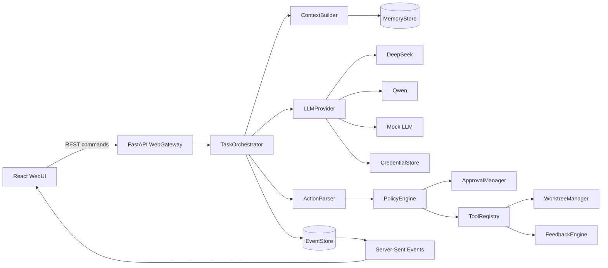

# Coding Agent Harness 设计规约

- **状态：** Brainstorming 与实施计划已完成；用户已于 2026-07-15 再次批准本规约，当前重新执行陌生智能体冷启动门禁，门禁通过前暂停新增实现
- **设计批准日期：** 2026-07-14
- **最终复核批准日期：** 2026-07-15
- **主要贡献：** 可确定性验证、可恢复的编码反馈闭环
- **目标用户：** 需要 AI 直接操作项目并交付代码与文档的程序员

## 1. 问题陈述

现有对话式编程助手往往只提供代码片段或建议，程序员仍需自行定位文件、应用修改、运行检查、整理失败和维护文档。本项目构建一个本地优先的 Coding Agent Harness：程序员输入需求后，agent 在隔离 Git worktree 中读取和修改项目、执行验证、根据客观失败信号自我修正，并交付可审查的代码 diff、测试证据和文档。

系统的价值不依赖模型“自觉安全”或“自行检查”。主循环、工具分发、治理审批、反馈分类、修正预算、记忆筛选和停机判断均由本仓库的确定性代码实现。真实 LLM 只负责提出下一步动作；替换为 Mock LLM 后，核心机制仍须能够离线单测。

## 2. 目标、范围与非目标

### 2.1 产品目标

1. 从自然语言需求出发，端到端交付可运行代码、验证证据和必要文档。
2. 默认先生成计划并等待用户批准；用户明确声明不需要计划时才直接执行。
3. 为 Python 和 Node.js 项目提供自动识别与默认验证，其他项目通过声明式命令接入。
4. 将危险动作、客观反馈、记忆和停机条件实现为可离线验证的代码机制。
5. 通过事件驱动状态机支持暂停、审批、崩溃恢复和任务继续。
6. 提供本地 WebUI，以及使用 Mock LLM 和临时沙箱的公网机制演示。

### 2.2 首版范围

- 本地单用户 WebUI。
- 本地 Git 项目与每任务独立 worktree。
- DeepSeek、Qwen 和 Mock LLM。
- 受限文件、搜索、patch、Shell、验证和 Git 工具。
- 计划审批、危险动作审批和最终审查。
- 测试、lint、类型检查和构建反馈。
- SQLite 事件、任务、审批、验证和长期记忆。
- Docker/OCI 分发与 Render 公网演示。

### 2.3 非目标

- 不替代 IDE，不实现完整在线代码编辑器。
- 不提供多用户、多租户或团队权限系统。
- 不提供通用多 agent 产品编排。
- 不自动接入云端私有仓库。
- 不承诺所有语言的 AST 级重构。
- 不在未审批时部署、push、merge 或发布。
- 不把“检查通过”表述为对未覆盖业务语义的绝对正确证明。

## 3. 用户故事

1. 作为程序员，我可以添加一个本地 Git 项目，让系统识别语言、结构和验证命令，以便开始任务。
2. 作为程序员，我可以用自然语言描述需求，并默认先审阅任务计划，以免 agent 误解目标。
3. 作为熟悉风险的程序员，我可以明确要求跳过计划，让 agent 直接在隔离 worktree 中执行。
4. 作为程序员，我可以实时查看状态、工具调用、验证结果和剩余预算，以判断任务是否正常推进。
5. 作为程序员，我可以查看危险动作的原因和影响范围，并批准或拒绝。
6. 作为程序员，我可以审查代码 diff、测试证据和文档，再决定是否 commit、merge 或 push。
7. 作为程序员，我可以在服务重启后恢复任务，并在失败升级后补充信息继续执行。
8. 作为程序员，我可以安全录入、更新和清除 DeepSeek/Qwen 凭据，状态查询不会回显明文。
9. 作为不同技术栈项目的维护者，我可以使用 Python/Node.js 默认验证或声明自定义命令。
10. 作为程序员，我可以管理允许持久化的约定和决策，并确信隐私与凭据不会进入记忆。

这些故事相互独立、对用户有价值、范围有限且可由 WebUI/API 流程和确定性测试验收。

## 4. 功能规约

### 4.1 项目接入与仓库地图

- **输入：** 用户选择的本地目录。
- **行为：** 规范化路径；验证 Git 根目录；读取跟踪文件、README、AGENTS、配置、测试位置和最近提交；识别 `pyproject.toml`、Python 测试工具、`package.json`、Node.js 脚本；生成仓库地图。
- **输出：** Workspace 记录、项目摘要、建议验证配置和信任请求。
- **边界：** 正式支持不超过 10,000 个 Git 跟踪文件；忽略 `.git`、依赖和构建目录；不读取工作区外内容。
- **错误：** 非 Git 目录、路径不存在、路径无权限、符号链接逃逸和配置解析错误均返回可操作错误，不创建可执行任务。

### 4.2 任务与计划

- **输入：** Workspace、自然语言需求、可选的“跳过计划”明确标志。
- **行为：** 创建任务和 worktree；默认调用 LLM 生成结构化计划；展示目标、步骤、拟用工具和验证；等待批准。只有显式跳过计划时可直接进入决策状态。
- **输出：** 有版本的 Plan、审批记录或直接执行事件。
- **边界：** 空需求被拒绝；计划变化生成新版本；旧版本审批失效。
- **错误：** 计划格式无效可安全重试；达到 Provider 重试限制后进入 `WAITING_USER`。

### 4.3 Agent 主循环与动作解析

- **输入：** 用户需求、已批准计划、检索上下文、工具 schema、最近事件和反馈。
- **行为：** 组装上下文；调用 `LLMProvider`；将响应解析为严格类型化 Action 或完成声明；按状态机分发；每轮更新预算。
- **输出：** Action、完成候选或结构化升级报告。
- **边界：** LLM 不能直接执行工具；未知工具、额外字段、非法参数和非法状态动作被拒绝；单任务最多 8 个完整验证—修正循环。
- **错误：** Provider、协议、动作 schema 和非法状态错误分别分类；仅无副作用请求可自动重试。

### 4.4 工具系统

- **输入：** 已校验 Action 和当前 worktree 能力集合。
- **行为：** 分发只读文件、搜索、仓库地图、原子 patch、受限 Shell、验证、Git 状态/diff/checkpoint 等工具；输出先截断和脱敏再写事件。
- **输出：** 标准 `ToolResult`，含状态、摘要、耗时、错误类别和可选结构化数据。
- **边界：** 普通 Agent 工具的所有路径必须位于 worktree；路径逃逸固定拒绝，任何审批都不能把普通文件、patch 或 Shell 工具提升为越界能力。用户确需交换外部文件时，只能使用 Harness 宿主提供的受控导入/导出接口：展示精确源、目标和方向，取得一次性审批后复制文件，Agent 仍只操作 worktree 内副本。patch 携带旧版本校验；命令固定 cwd、超时、输出上限和敏感环境清理。
- **错误：** 文件冲突、越界、命令失败、超时、取消和输出过大具有独立错误码。

### 4.5 治理与审批

- **输入：** Action、规范化路径、命令结构、任务状态和 Workspace 信任配置。
- **行为：** `PolicyEngine` 判定 ALLOW、REQUIRE_APPROVAL 或 DENY；`ApprovalManager` 创建带事件版本和过期时间的审批；批准后重新校验当前状态再执行。
- **输出：** 策略决定、审批请求或拒绝结果。
- **必须审批：** 删除文件、宿主受控导入/导出、安装依赖、由工具发起的任意外部网络请求、Git push/merge、发布和高风险 Shell。普通工具的工作区外路径直接 `DENY/PATH_ESCAPE`；批准宿主导入/导出只产生绑定精确源、目标、方向、事件版本和有效期的一次性复制能力，不能授权 Agent 工具直接越界。用户选择真实 provider 并启动/继续任务时，授权该任务所需的 LLM API 调用；此授权不扩展到 Shell、依赖安装或其他工具网络访问，并可通过暂停/取消任务撤销。
- **边界：** 仓库声明的验证命令首次执行需要建立信任；配置变化后重新审批；批准只对精确动作和版本有效。
- **错误：** 过期、重复、错误版本或已取消任务的审批被拒绝。

### 4.6 确定性反馈闭环（主要贡献）

- **输入：** 项目验证配置、修改文件集合和工具执行结果。
- **行为：** 修改后运行受影响的快速检查；完成候选运行完整测试、lint、类型检查和构建；解析输出为失败分类与稳定指纹；计算失败数量和类别变化；将结构化反馈回灌 LLM。
- **输出：** VerificationRun、反馈摘要、进展判断和下一状态。
- **预算：** 同一失败指纹最多修正 3 轮；单任务最多 8 轮；连续 2 轮未减少失败且未改变类别时提前升级；默认单命令超时 5 分钟，项目可覆盖。
- **边界：** 未配置检查时不能宣称完成；完整验收不可被 LLM 跳过；测试输出不作为可信指令。
- **错误：** 检查命令自身损坏与代码检查失败分开分类；超时、取消和配置变化触发人工介入。

### 4.7 上下文与长期记忆

- **输入：** 需求、仓库地图、搜索结果、项目约定、架构决策、工具目录、任务结论和失败经验。
- **行为：** 按任务相关性和上下文预算选择信息；任务结束后仅从类型白名单提炼 MemoryRecord；写入前执行敏感信息扫描与脱敏。
- **输出：** 有来源的上下文片段和 MemoryRecord。
- **允许持久化：** 项目约定、架构决策、工具说明、完成任务摘要、失败经验和用户明确制定的项目要求。
- **禁止持久化：** Key、token、密码、隐私信息、完整环境变量、凭据文件、未经选择的完整对话和源码副本。
- **错误：** 敏感检测命中时拒绝写入并记录不含原值的审计事件。

### 4.8 Worktree 与 Git 助手

- **输入：** Workspace、任务 ID 和基准提交。
- **行为：** 为任务创建独立分支/worktree；提供状态、diff、checkpoint、commit message 和 PR 摘要；最终审查后执行获批 Git 动作。
- **输出：** worktree、diff、checkpoint 和 Git 产物。
- **边界：** 主工作区脏状态不会被覆盖；一个 Workspace 同时只有一个写任务；push/merge 必须审批。
- **错误：** 分支冲突、worktree 已存在、基准变化和 Git 锁冲突进入人工处理。

### 4.9 代码产物与文档同步

- **输入：** 实际 diff、验证结果和用户需求。
- **行为：** 生成任务总结、变更说明、测试证据、使用说明和必要的 README/API 文档 patch。
- **输出：** Artifact 列表与最终审查包。
- **边界：** 文档必须引用实际文件和验证结果；不得虚构通过的命令或未实现能力。
- **错误：** 文档与当前 diff 版本不一致时作废并重新生成。

### 4.10 WebUI

- **输入：** 项目、需求、审批决定、任务控制和设置。
- **行为：** 提供项目页、新任务、任务工作台、审批中心、任务历史、设置和公网演示；REST 处理命令，SSE 推送事件。
- **输出：** 状态、计划、事件、diff、检查结果、产物和凭据状态。
- **边界：** 本地服务默认只监听 `127.0.0.1`；校验 Origin 和启动时会话令牌；移动端只保证基本查看。
- **错误：** 断线后使用事件序号补发；过期 UI 不能批准已变化动作。

### 4.11 凭据生命周期

- **输入：** 隐藏录入的供应商 API Key 或容器主密码。
- **行为：** 本机存入系统钥匙串；容器使用 Argon2id 派生密钥和 AES-256-GCM 认证加密文件；提供状态、更新和清除。
- **输出：** 仅返回供应商、是否配置和更新时间。
- **边界：** `.env` 只作为开发备用且明确标注风险；公网演示不接受真实 Key；明文不进入日志、事件、记忆或测试快照。
- **错误：** 钥匙串不可用、主密码错误、密文损坏和权限不足返回分类错误，不回显敏感内容。

## 5. 领域与机制设计

### 5.1 Coding 领域四类机制

- **动作/工具：** 读文件、搜索、生成仓库地图、原子 patch、受限 Shell、运行测试/lint/类型检查/构建、查看 Git 状态与 diff、创建 checkpoint。
- **客观反馈：** 命令退出码、结构化测试报告、lint/type/build 诊断、失败指纹、失败计数变化和超时。
- **危险动作：** 删除、越界、安装、网络、push/merge/发布和高风险 Shell，由代码护栏与 HITL 状态实现。
- **记忆：** 只保存允许类型并按需检索，明确排除隐私和凭据。

### 5.2 六个 harness 维度

| 维度 | 最低可运行实现 | 确定性验证方式 |
|---|---|---|
| 决策 | 状态机、上下文组装、LLM 抽象、动作解析、停机 | Scripted Mock LLM 驱动状态迁移 |
| 工具 | 类型化注册表和标准结果 | 临时目录/仓库中的工具单测 |
| 记忆 | SQLite 白名单存储与检索 | 敏感样本拒绝和相关记录选择 |
| 治理 | 策略决定、审批版本、路径围栏 | 构造危险 Action 断言暂停/拒绝 |
| 反馈 | 校验器、分类、指纹、进展与预算 | 故障注入和稳定输出断言 |
| 配置 | 项目验证、模型、预算和保留期 | schema、默认值和变化失效测试 |

### 5.3 重点维度

主要贡献是反馈闭环：它不仅运行命令，还确定性地选择检查、分类失败、生成稳定指纹、衡量进展、控制修正预算、回灌下一轮并在无进展时升级人工。治理是完整支撑维度，但不与反馈闭环争夺主要贡献定位。

## 6. 状态机与数据流

主要状态为：

```text
CREATED → SCANNING → PLANNING → WAITING_PLAN_APPROVAL
        → DECIDING → WAITING_ACTION_APPROVAL / EXECUTING
        → VERIFYING → CORRECTING → DECIDING
        → WAITING_FINAL_REVIEW → COMPLETED
```

任意运行状态可进入 `WAITING_USER`、`FAILED` 或 `CANCELLED`。用户明确跳过计划时，从 `SCANNING` 进入 `DECIDING`，但不能绕过治理、验证和最终审查。

每次状态迁移和副作用完成后追加 TaskEvent。恢复时重放事件；若工具副作用是否完成无法确定，进入 `WAITING_USER`，不得自动重放。

## 7. 系统架构



核心代码不调用 LangChain AgentExecutor、AutoGen、CrewAI、LlamaIndex agent 或其他高层 agent runner。允许使用 HTTP/LLM SDK、解析库、SQLite 驱动和测试库作为底层零件。

## 8. 数据模型

| 实体 | 关键字段与约束 |
|---|---|
| Workspace | 规范化路径、Git 根、默认分支、语言、验证配置；路径唯一 |
| Task | 需求、worktree、状态、预算、时间；属于一个 Workspace |
| TaskEvent | 单调序号、类型、脱敏载荷、前后状态；只追加 |
| Plan | 版本、内容、状态、批准时间；旧审批随新版本失效 |
| Action | 类型、参数摘要、风险、幂等键、状态 |
| Approval | 目标、原因、决定、操作者、事件版本、过期时间 |
| HostTransfer | 方向、外部路径、worktree 内路径、源/目标文件身份、审批 ID、幂等键、状态、结果摘要；状态只允许 `WAITING_APPROVAL`、`EXECUTING`、`COMPLETED`、`FAILED`、`UNCERTAIN` |
| ToolExecution | 工具、脱敏输入摘要、状态、耗时、截断输出、错误类 |
| VerificationRun | 检查类型、命令、失败数、指纹、进展 |
| Artifact | 类型、路径、关联事件版本；不复制完整源码 |
| MemoryRecord | 类型、来源、标签、置信度、内容、更新时间 |
| CredentialReference | 供应商、钥匙串引用、状态、更新时间；无 Key |

## 9. 非功能性要求

### 9.1 性能

- 10,000 个跟踪文件范围内，排除目录后的首次扫描目标为 5 秒内。
- 事件持久化后 1 秒内推送到 WebUI。
- 一个 Workspace 最多一个写任务，全局默认最多 3 个并发任务。
- 文件、输出、上下文和子进程均有可配置上限。

### 9.2 安全威胁模型

威胁包括凭据误提交/泄漏、仓库 prompt injection、路径/符号链接逃逸、恶意验证配置、Shell 注入、审批重放、用户并发修改、日志泄漏和副作用重复执行。对策包括钥匙串/认证加密、统一脱敏、规范化路径、类型化动作、策略引擎、版本化审批、原子 patch、worktree、幂等键和不确定副作用人工接管。

### 9.3 可用性

- 桌面优先，键盘可操作，焦点清晰，不仅依靠颜色表达状态。
- 错误展示失败命令、类别、尝试、最后变化和建议操作。
- 用户可暂停、继续、取消和恢复任务。

### 9.4 可观测性

- 结构化日志携带 task/event/action ID、耗时、状态、类别和重试次数。
- SQLite 事务和 WAL；事件先落盘再推送。
- 健康检查覆盖服务、数据库和工作区。
- 日志轮转且不记录源码全文、对话全文或凭据。

## 10. 技术选型与理由

- **Python 3.11 + FastAPI + Pydantic：** 适合子进程、文件、LLM API、状态服务和类型化 schema。
- **SQLite：** 本地单用户、事务、事件重放和易分发；存储/检索逻辑由项目实现。
- **React + TypeScript + Vite：** 适合审批、事件、diff 和测试密集型 WebUI。
- **pytest、Ruff、mypy、Vitest、Playwright：** 支撑离线核心单测、静态检查与端到端验收。
- **Open Design：** 采用 `dashboard` skill 和 `Neutral Modern` design system，适配数据密集的桌面工作台。
- **Provider：** DeepSeek 与 Qwen 使用 OpenAI-compatible 单次对话/工具调用接口，内部通过自定义 `LLMProvider` 隔离。
- **SSE：** 首版事件单向推送足够，复杂度低于 WebSocket。

## 11. 凭据、分发与部署

### 11.1 凭据流程

首次选择真实 provider 时，WebUI 引导隐藏录入；保存后仅显示状态。用户可以更新和清除。本机使用 OS keyring；容器使用主密码 + Argon2id + AES-256-GCM 认证加密文件与持久卷。`.env` 备用方式必须在 README 标明明文和进程可见风险。

### 11.2 Docker/OCI 分发

- 单条 `docker build` 构建，单条 `docker run` 启动。
- 显式挂载项目和状态目录，不挂载整个主目录。
- 目标镜像为 `linux/amd64` 与 `linux/arm64`，发布到 GHCR。
- GitHub Actions 每次 push 测试并构建镜像，发布标签时推送。

### 11.3 公网演示

Render Docker Web Service 运行 Mock LLM 和内置示例项目。演示没有真实 Key、外部网络、任意挂载或 Git push；临时状态可在休眠/重启后丢失。README 明确免费实例休眠、冷启动和临时文件系统限制。

## 12. 测试与机制演示

统一命令：

```text
make test
make test-unit
make test-e2e
make demo
```

核心机制测试全部使用 Scripted Mock LLM，不联网、不需要 API Key。覆盖主循环、状态迁移、provider 转换、动作 schema、工具分发、六类治理、路径围栏、反馈分类、指纹、预算、恢复、记忆脱敏和凭据状态。

`make demo` 确定性复现：

1. 危险删除 Action 被拦截并进入审批。
2. 首次代码导致测试失败；反馈回灌后 Mock LLM 改变动作，测试通过。
3. 连续无进展产生稳定失败指纹，第二轮后进入 `WAITING_USER` 并输出升级报告。

集成测试使用临时 Python 和 Node.js Git fixture；WebUI 使用 Vitest 与 Playwright。GitHub Actions 运行测试、静态检查和 Docker 构建；`.gitlab-ci.yml` 必须包含名为 `unit-test` 的 job。

## 13. 验收标准

1. 用户可从 WebUI 添加有效 Git 项目并看到识别结果；越界/无效路径被拒绝。
2. 默认任务生成计划且未经批准不修改文件；显式跳过计划可进入执行。
3. 每个任务只修改独立 worktree，主分支在最终批准前不变。
4. DeepSeek/Qwen 可通过同一内部接口配置；Mock LLM 可完全替换真实 provider。
5. 删除、受控导入/导出、依赖安装、工具网络、Git 远程变更/发布和高风险 Shell 全部有确定性拦截测试；普通工具路径逃逸固定拒绝，过期审批不能执行。
6. Python/Node.js fixture 的快速与完整验证可运行；其他项目可声明命令。
7. 失败分类、指纹、3/8 预算和连续 2 轮无进展规则有离线测试。
8. 服务重启可恢复安全状态；不确定副作用不会自动重复。
9. 凭据支持录入、状态、更新和清除，仓库/日志/事件/记忆中无明文。
10. `make test`、`make demo` 和 Docker 冷启动在干净环境通过。
11. GitHub Actions 与 GitLab `unit-test` job 最终为绿色。
12. 公网 Mock 演示 URL 在交付时可访问，并展示三项机制行为。

## 14. 风险与已决问题

- Provider 协议变化：adapter 和契约测试隔离；模型名是运行配置，不固化架构。
- Prompt injection 与配置投毒：不可信数据边界、策略、首次命令信任和变化失效。
- Windows/Docker/worktree 差异：Windows 与 Linux 集成测试。
- 无效修正和成本：反馈预算、无进展检测、上下文选择和调用可见性。
- 文档幻觉：只基于实际 diff/验证生成，最终人工审查。
- Render 免费限制：只用于可重建的临时 Mock 演示。

当前没有阻止进入实现计划的产品设计未决项。发布时的实际 URL、镜像标签和用户选择的模型名称属于发布/运行配置；交付审计必须验证其真实存在，不能保留占位值。

## 15. 参考资料与第三方边界

- [课程指定 Superpowers](https://github.com/obra/superpowers)
- [Open Design](https://github.com/nexu-io/open-design)（Apache-2.0）
- [DeepSeek API 文档](https://api-docs.deepseek.com/zh-cn/)
- [Qwen OpenAI-compatible API](https://help.aliyun.com/en/model-studio/qwen-api-reference/)
- [Render Docker 部署](https://render.com/docs/docker)
- [Render 免费服务限制](https://render.com/docs/free)

具体依赖及许可证将在实现计划确定版本后写入 README；高层 agent 框架不属于允许依赖。
